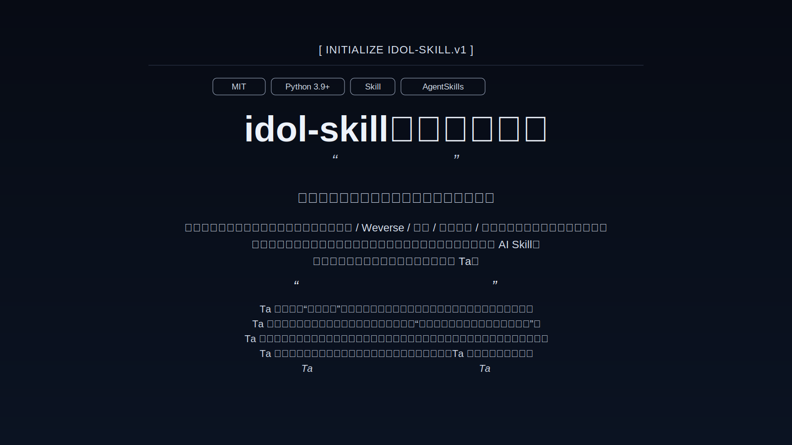

# idol-skill

> 为了你，千千万万次回到那个夏天。

Agent Skill + CLI 工程：  
把公开物料与用户主观记忆蒸馏为“高光时期的理想化偶像陪伴人格”。

<p align="center">
  
  
  
  
</p>

---

<a id="demo"></a>

<div align="center">
  <a href="#data-sources">
    
  </a>
  <br>
  <strong><a href="#data-sources">[ 数据来源 ]</a> ｜ <a href="./INSTALL.md#install-doc">[ 安装说明 ]</a> ｜ <a href="#usage">[ 使用指南 ]</a> ｜ <a href="#demo">[ 效果示例 ]</a> ｜ <a href="./README_EN.md">[ English ]</a></strong>
</div>

<a id="supported-sources"></a>
### `idol-skill`，蒸馏爱豆

提供自担的公开原材料（图片、视频、舞台、访谈、公开社媒内容）+ 你的主观描述，  
生成一个停留在你最偏爱时期气质与表达风格的理想化 AI Skill。

> “我会把你封存在我最爱你的那一秒。”

> “最接近你心里的那一版 Ta”。

<a id="data-sources"></a>
## 数据来源

- 公开图片与截图（舞台图、活动图、公开社媒图）
- 公开视频与字幕（舞台、采访、物料切片）
- 公开文本资料（采访稿、公开发言、时间线整理）
- 粉丝主观描述（你对高光时期的气质与表达偏好）
- 本地补充文本（手动粘贴与结构化记忆片段）

## 开源定位

- **项目类型**: Agent Skill 仓库（根目录即 skill 目录）
- **发布渠道**: GitHub
- **推荐安装路径**: `.claude/skills/idol-skill`（兼容 Cursor）
- **运行方式**: 本地 Python CLI

<a id="install"></a>
## 安装（推荐）

在你的项目仓库根目录执行：

```bash
mkdir -p .claude/skills
git clone https://github.com/1ffect/idol-skill.git .claude/skills/idol-skill
```

然后重启会话，在 Agent 中可通过 `/idol-skill` 显式触发（或由模型按描述自动调用）。

> 兼容 Cursor：Cursor 会识别 `.claude/skills` 下的技能目录。  
> 如果你偏好 Cursor 原生目录，也可放到 `.cursor/skills/idol-skill`。

<a id="usage"></a>
## 本地开发快速开始

```bash
pip install -r requirements.txt
python scripts/auto_ingestion.py data/raw/input.txt
python scripts/confirm_ingestion.py
python scripts/build_index.py
python scripts/chat.py
```

可选体验：

```bash
python scripts/bias_room.py
python scripts/if_timeline.py "写一段平行采访片段"
```

## 核心能力

- `Auto Ingestion`: 原始文本清洗、分段、标签化，先进入待确认区
- `Archive Preview Confirmation`: 先预览后封印，降低脏数据污染
- `Memory Layers`: `core / emotional / dynamic / augmented / corrections`
- `RAG Retrieval`: 结合语义、标签、时代、可信度做检索
- `Persona Matrix`: 四种表达人格模板
- `Stealth Augmentation`: 默认关闭联网，低频低权重补充环境细节
- `OOC Correction`: 用户反馈可回写修正规则


## 项目结构

```text
idol-skill/
├── SKILL.md
├── prompts/
├── scripts/
├── src/
├── templates/
├── memories/
├── config/
├── examples/
├── skills/
├── triggers/
├── data/                 # 本地运行数据目录（多数产物已 gitignore）
├── requirements.txt
└── LICENSE
```

## 环境变量

未配置 API key 也可以运行（自动 fallback）。可选变量：

- `OPENAI_API_KEY`
- `OPENAI_BASE_URL`
- `IDOL_SKILL_API_KEY`
- `IDOL_SKILL_BASE_URL`

## 许可证

本仓库使用 `LICENSE` 中声明的许可协议。
